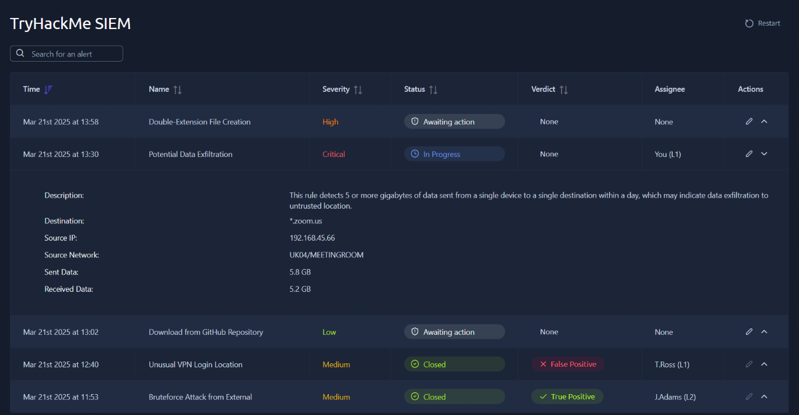
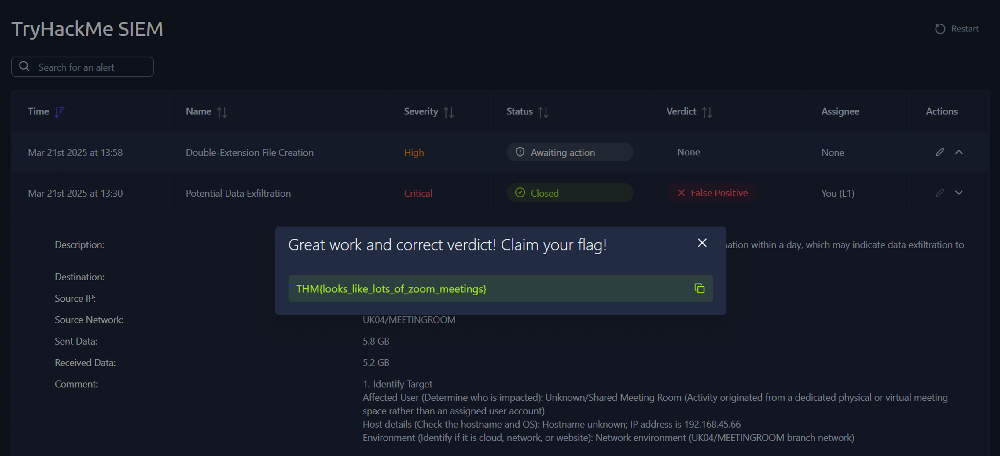

# 🛡️ SOC L1 Lab: Alert Triage & SIEM Queue Management

**Platform:** TryHackMe | **Path:** SOC Level 1 | **Lab:** SOC L1 Alert Triage  
**Focus:** Alert Properties, Severity Sorting, & Alert Verdicts

-----

## 📌 1. Executive Summary & Lab Overview
This laboratory replicates a live Security Operations Center (SOC) triage environment within TryHackMe's SIEM dashboard. The objective of this lab is to demonstrate a systematic approach to handling security alerts, understanding common alert properties, prioritizing alerts based on risk, and establishing defensible risk classifications (True Positive vs. False Positive).

### 🎯 Core Learning Objectives
* **Alert Lifecycle:** Understanding alert logs and automated detection rule triggers.
* **Alert Property Analysis:** Evaluating SIEM metadata fields to establish threat context and scope.
* **Systematic Queue Prioritization:** Applying a three-step sorting methodology to prioritize critical threats.
* **Operational Triage Execution:** Investigating networks, validating external domains, writing structured analyst comments, and closing risk tickets.

---

## 📊 2. SIEM Alert Properties Reference
During triage operations, alerts were evaluated across six standardized alert properties within the TryHackMe SIEM console:

| Property | Description | Operational Significance |
| :--- | :--- | :--- |
| **Alert Time** | Event creation timestamp (UTC) ⏱️| Establishes attack chronology and timeline |
| **Alert Name** | Summary of the triggering detection rule 🏷️| Identifies potential adversary behavior (e.g., Data Exfiltration) |
| **Alert Severity** |Urgency ranking (Critical🔥/High 🔴 /Med 🟡/Low 🔵) | Dictates queue triage priority |
| **Alert Status** | Ticket state (New🆕, In Progress ⏳, Closed ✅) | Tracks workflow progress and ticket ownership |
| **Alert Verdict** | Incident classification (True Positive 💥/ False Positive💨) | Confirms whether an actual security threat exists |
| **Alert Assignee** | Designated analyst 🧑‍💻 (e.g., You (L1), L2 etc..) | Maintains analyst accountability |

---

## ⚙️ 3. SOC Alert Prioritization Framework
To efficiently process incoming SIEM queues without missing active security breaches, alerts are triaged according to a standardized three-step protocol:

1. **Queue Filtering (Unassigned Alerts):** Filter the dashboard for `New / Unassigned` status to prevent duplicate analyst effort and maintain clean team ownership.
2. **Severity-Based Ranking:** Sort unresolved alerts by urgency level (**Critical ➔ High ➔ Medium ➔ Low**). Higher severity alerts indicate a greater likelihood of critical business impact or active compromise.
3. **Timestamp Prioritization (Oldest First):** Addressing older alerts first minimizes further damage to the business, as those attackers have already spent time inside the network and may be actively extracting valuable data.

---

## 🔍 4. Alert Triage Examples

### 🚨 Alert Profile 1 
* **Alert Name:** Potential Data Exfiltration 📊
* **Alert Description:** 
This rule detects 5 or more gigabytes of data sent from a single device to a single destination within a day, which may indicate data exfiltration to untrusted location.
* **Assigned Severity:** Critical 🔥
* **Initial Status:** New ➔ Updated to In Progress (Self-Assigned)
* **Assigned Analyst:** You (L1)

### 📁 Network Traffic Analysis
* **Source Network:** UK04/MEETINGROOM
* **Source IP Address:** 192.168.45.66
* **Destination Domain:** zoom.us
* **Outbound Traffic (Sent Data):** 5.8 GB
* **Inbound Traffic (Received Data):** 5.2 GB

*Figure 1: Self-assigning the Critical "Potential Data Exfiltration" alert and updating status to In Progress.*

---

### **Final Verdict:** 💨 **False Positive**

> ### **Alert Profile 1 Triage Investigation:**
> 
> #### **1. Identify Target**
> * **Affected User (Determine who is impacted):** Unknown/Shared Meeting Room (Activity originated from a dedicated physical or virtual meeting space rather than an assigned user account)
> * **Host details (Check the hostname and OS):** Hostname unknown; IP address is `192.168.45.66`
> * **Environment (Identify if it is cloud, network, or website):** Network environment (`UK04/MEETINGROOM` branch network)
> 
> #### **2. Analyze Action Performed**
> * **Alert Category (Identify the core threat (e.g., suspicious login, malware, phishing)):** Large Data Transfer or Potential Data Exfiltration
> * **Activity Type (Document the exact action described in the alert):** High-volume outbound network traffic (`5.8 GB` sent, `5.2 GB` received within a single day to an external destination)
> 
> #### **3. Review Timeline**
> * **Pre-Alert Events (Look for suspicious actions shortly before the alert):** Unknown
> * **Post-Alert Events (Look for suspicious actions shortly after the alert):** Unknown
> 
> #### **4. Leverage Threat Intelligence**
> * **External Verification (Query threat intelligence platforms):** Looked at the source IP address and pasted into AbuseIPDB and nothing harmful was found.
> * **Resource Cross-Reference (Use available tools to verify your findings):** Used the tool, VirusTotal with the source IP and nothing harmful detected.
> * **Legitimacy Assessment (Determine if the activity is malicious or a false positive):** False Positive because of high definition video conferencing demands more data to be sent

*Figure 2: AbuseIPDB, tool used, given the specific source IP address.*

*Figure 3: VirusTotal, tool used, given the specific source IP address.*

*Figure 4: Verdict proven correct and hence we can claim the flag.*

--- 

### 🚨 Alert Profile 2
* **Alert Name:** Double-Extension File Creation 💾
* **Alert Description:** 
This rule detects a creation of a double-extension file like '*.pdf.exe' or '*.gif.lnk', often used by hackers in phishing attacks to trick users into opening the malicious executable.
* **Assigned Severity:** High 🔴
* **Initial Status:** New ➔ Updated to In Progress (Self-Assigned)
* **Assigned Analyst:** You (L1)

### 💻 Endpoint & Process Analysis
* **Host:** LPT-HR-009
* **Process Name:** chrome.exe
* **Process User:** S.Conway
* **Target File:** C:\Users\S.Conway\Downloads\cats2025.mp4.exe
* **File MotW::** https://freecatvideoshd.monster/cats2025.mp4.exe 
* **File MD5::** 14d8486f3f63875ef93cfd240c5dc10b

*Figure 5: Self-assigning the High "Double-Extension File Creation" alert and updating status to In Progress.*

---

### **Final Verdict:** 💥 **True Positive**

> ### **Alert Profile 2 Triage Investigation:**
> 
> #### **1. Identify Target**
> * **Affected User (Determine who is impacted):** S.Conway
> * **Host details (Check the hostname and OS):** LPT-HR-009
> * **Environment (Identify if it is cloud, network, or website):** Endpoint device 
> 
> #### **2. Analyze Action Performed**
> * **Alert Category (Identify the core threat (e.g., suspicious login, malware, phishing)):** Creation of a double-extension file like '*.pdf.exe' or '*.gif.lnk', often used by hackers in phishing attacks to trick users into opening the malicious executable file.
> * **Activity Type (Document the exact action described in the alert):** Double-extension file creation (`cats2025.mp4.exe`) in the user's Downloads directory.
> 
> #### **3. Review Timeline**
> * **Pre-Alert Events (Look for suspicious actions shortly before the alert):** The user navigated to an untrusted domain via Chrome.
> * **Post-Alert Events (Look for suspicious actions shortly after the alert):** Unknown (Investigation required to confirm if the executable was manually launched by the user).
> 
> #### **4. Leverage Threat Intelligence**
> * **External Verification (Query threat intelligence platforms):** Looked at the Mark-of-the-Web( MotW): `https://freecatvideoshd.monster` and noticed the untrusted domain. This is made to attack the host system.
> * **Resource Cross-Reference (Use available tools to verify your findings):** Searched the file MD5: `14d8486f3f63875ef93cfd240c5dc10b` on VirusTotal to reveal malware with 51/71 security vendors being flagged as malicious. 
> * **Legitimacy Assessment (Determine if the activity is malicious or a false positive):** True Positive. The alerts shows double-extension structure (`.mp4.exe`) delivered from an untrusted domain (`.monster`).

*Figure 6: VirusTotal, tool used to analyze the alert using the MD5 file which resulted in as shown.*

*Figure 7: Verdict proven correct to capture the flag.*

--- 

### 🚨 Alert Profile 3 
* **Alert Name:** Download from GitHub Repository 📥
* **Alert Description:** This rule detects any download from GitHub. While GitHub stores lots of great projects that our IT team uses, it also stores malicious scripts and exploits that must not be downloaded by the users.
* **Assigned Severity:** Low 🔵 
* **Initial Status:** New ➔ Updated to In Progress (Self-Assigned)
* **Assigned Analyst:** You (L1)

### 📦 GitHub Repository Download Analysis
* **Accessed URL:** https://github.com/facebook/react
* **Source User:** G.Chandler
* **Source Host:** LPT-IT-063
* **Source Network:** VPN/DEVELOPERS

*Figure 8: Self-assigning the Low "Download from GitHub Repository" alert and updating status to In Progress.*

---

### **Final Verdict:** 💨 **False Positive**

> ### **Alert Profile 3 Triage Investigation:**
> 
> #### **1. Identify Target**
> * **Affected User (Determine who is impacted):** G.Chandler
> * **Host details (Check the hostname and OS):** LPT-IT-063
> * **Environment (Identify if it is cloud, network, or website):** Source Network - VPN/DEVELOPERS
> 
> #### **2. Analyze Action Performed**
> * **Alert Category (Identify the core threat (e.g., suspicious login, malware, phishing)):** GitHub Download 
> * **Activity Type (Document the exact action described in the alert):** User accessed and attempted a download from the URL: https://github.com/facebook/react
> 
> #### **3. Review Timeline**
> * **Pre-Alert Events (Look for suspicious actions shortly before the alert):** Unknown
> * **Post-Alert Events (Look for suspicious actions shortly after the alert):** Unknown
> 
> #### **4. Leverage Threat Intelligence**
> * **External Verification (Query threat intelligence platforms):** Looked at the Accessed URL, subjected it to analysis by the URLScans tool and saw no threat, 0/100 risk and VirusTotal also flagged no threat.
> * **Resource Cross-Reference (Use available tools to verify your findings):** GitHub.com is a common and approved standard for use within IT development teams. The repository structure is also not alarming.
> * **Legitimacy Assessment (Determine if the activity is malicious or a false positive):** The download originates from a valid network (VPN/DEVELOPERS) accessing a highly trusted, standard development library (react) through the approved GitHub. No malicious indicators are present in the provided URL.

*Figure 9: URLScans, tool analyzed to see threat.*

*Figure 10: VirusTotal, tool showed zero threat flags.*

*Figure 11: Verdict proven correct to capture the flag.*

---

## 🏁 Conclusion & Lab Review

### 📊 Triage Summary Matrix

| Alert ID | Alert Description | Final Verdict |
| :--- | :--- | :--- |
| **Alert 1** | Potential Data Exfiltration (*.zoom.us) | 💨 **False Positive** |
| **Alert 2** | Double-Extension File Creation (.mp4.exe) | 💥 **True Positive** |
| **Alert 3** | GitHub Code Repository Download (React) | 💨 **False Positive** 

---

### 🔑 Key Takeaways & Lessons Learned

1. **Contextual Classification:** Alerts can come in a variety of forms (emails, websites, etc.), and knowing how to classify them appropriately is important, with specific changes made depending on the organization. 

2. **The Risk of File Deception:** Alerts can show how attackers use simple social engineering tactics, like masquerading an executable as a harmless media file (`cats2025.mp4.exe`) using double extensions, to bypass basic scrutiny. 

3. **Analytical Data Interpretation:** Alert triage is important, but so is the analyst's ability to collect and interpret data to safely resolve the alert.

***

*This lab write-up concludes the TryHackMe SOC L1 Alert Triage practical exercise.*

