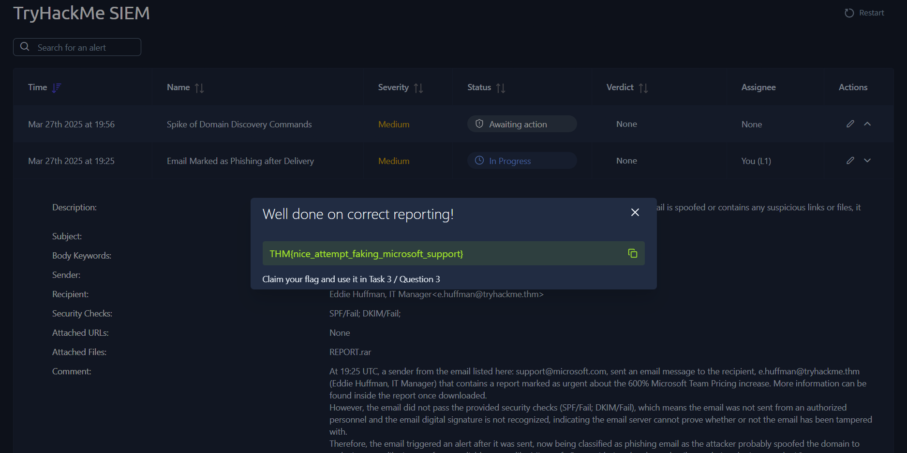

# 🔵 SOC L1 Lab: Alert Reporting, Escalation, & Communication
**Platform:** TryHackMe | **Path:** SOC Level 1 | **Lab:** SOC L1 Alert Reporting

**Focus:** Alert Reporting, Alert Escalation, & Alert Communication

**Severity Tiers Used:** 🔥 Critical | 🔴 High | 🟡 Medium | 🔵 Low

**Hyperlink Back to SOC L1 Alert Triaging:** **[Hyperlink Back to SOC L1 Alert Triaging](https://github.com/merinjayeson/cybersecurity-portfolio/blob/main/SOC-Operations/L1-Alert-Triage-Lab/README.md)**

---

## 📌 1. Executive Summary & Lab Overview
In this laboratory environment for TryHackMe, the **SOC L1 Alert Reporting** phase emphasizes knowing how to accurately report, escalate, and communicate during an active alert sequence. This document outlines the critical steps required to process alert queues seamlessly—ranging from understanding structural guidelines when documenting comments, to recognizing specific criteria that necessitate an immediate ticket escalation, and ensuring clear communication metrics are maintained across the team. This lab functions as a direct continuation of the previously completed *SOC L1 Alert Triage* module, uniting defensive threat analysis with professional workflow reporting and operational handoffs.

### 🎯 Core Learning Objectives
* **Operational Reporting Value:** Understanding the critical requirement for SOC alert documentation and their significance to the alerting process.
* **Comment Quality Metrics:** Learning how to write descriptive analyst comments.
* **Escalation Protocol Execution:** Exploring defensive escalation methods, alert ownership reassignment, and tier-transfer best practices.
* **Crisis Communication Readiness:** Applying out-of-band communication procedures to resolve simulated threat scenarios and engineering log failures confidently.

---

## 📊 2. SIEM Alert Reporting Importance
Before processing advanced tickets, it is essential to understand why SOC Tier 1 analysts must thoroughly document findings rather than simply marking events with a basic True Positive or False Positive verdict. Comprehensive alert reporting helps tackle three critical issues within modern security operations:

| Alert Report Purpose | Explanation | Operational Significance |
| :--- | :--- | :--- |
| **Provide Context for Escalation** | A well-structured summary saves immense time for Tier 2 analysts. | Allows senior responders to instantly grasp the threat scope without repeating foundational alert analysis from scratch. |
| **Save Findings for the Records** | Raw SIEM indices are typically purged after 3–12 months, but alert logs remain indefinitely. | Preserves all historical security context directly inside the ticket infrastructure for compliance, auditing, and future lookbacks. |
| **Improve Investigation Skills** | Condensing highly complex alerts requires clear comprehension. | Serves as an exceptional skill-building exercise to refine an L1 analyst’s data interpretation and summary capabilities. |

---

## ⚙️ 3. SOC Alert Reporting & Escalation Framework
To process incoming alerts uniformly without dropping critical indicators, every flag or suspicious action is subjected to a mandatory five-point matrix coupled with strict tier-transfer thresholds.

### 1. The Five Ws Matrix
The on-board SIEM dashboard automatically grades all analyst comments against this five-point matrix, requiring a high-quality summary to meet evaluation metrics:
* **Who:** Identify the exact user accounts, email addresses, or system sessions executing the command lines or initiating the downloads.
* **What:** Record the precise malicious activities, execution paths, or anomalous event sequences observed.
* **When:** Record the exact UTC timestamps specifying when the suspicious activity officially started and concluded.
* **Where:** Log the target endpoints, source hostnames, external domains, or affected network zones involved in the alert.
* **Why:** Detail the absolute structural reasoning, technical indicators, and behavioral analysis that confirms your final verdict.

### 2. Escalation Trigger Thresholds
While standard alerts are closed directly at Tier 1, an SOC L1 analyst must immediately reassign ownership to an on-shift L2 analyst under the following four general scenarios:
1. **Major Cyberattack Indicators:** The alert details systemic malicious actions requiring deep investigation or specialized Digital Forensics and Incident Response (DFIR) procedures.
2. **Active Remediation Requirements:** The threat demands immediate operational intervention, including automated malware eradication, endpoint host isolation, or enterprise credential rotation.
3. **External Communication Dependencies:** The incident scope crosses organizational boundaries, requiring immediate coordination with corporate partners, clients, upper management, or law enforcement agencies.
4. **Alert Ambiguity:** The technical properties of the alert are not clearly understood by the L1 responder, requiring peer-to-peer knowledge sharing or senior oversight.

---

## 🔍 4. Alert Reporting & Escalation Examples

### 🚨 Alert Profile 1
* **Alert Name:** Email Marked as Phishing after Delivery
* **Alert Description:** The email was classified as phishing post-delivery after an automated analysis. If the email is spoofed or contains any suspicious links or files, it must be deeply investigated.
* **Assigned Severity:** Medium 🟡
* **Initial Status:** New → Shifted to **In Progress** (Self-Assigned)
* **Assigned Analyst:** You (L1)

### 📧 Phishing Alert Analysis
* **Subject:** Important Update: Microsoft Teams Pricing Increase
* **Body Keywords:** 600% price increase; urgent notice; download the report; read the details;
* **Sender:** Microsoft Support <support@microsoft.com>
* **Recipient:** Eddie Huffman, IT Manager <e.huffman@tryhackme.thm>
* **Security Checks:** SPF/Fail; DKIM/Fail;
* **Attached URLs:** None
* **Attached Files:** REPORT.rar

*Figure 1: Self-assigning the Medium “Email Marked as Phishing after Delivery” alert and updating status to In Progress.*

---

### 🎣 SOC L1 Analyst Analysis For Alert Profile 1

#### 📈 Alert Overview
* **My Analysis:** At 19:25 UTC, a sender from the email listed here: support@microsoft.com, sent an email message to the recipient, e.huffman@tryhackme.thm (Eddie Huffman, IT Manager) that contained a report marked as urgent about the 600% Microsoft Team Pricing increase. More information can be found inside the report once downloaded.

#### 🔏 Security Authentication Audit
* **Critical Protocol Failures:** However, the email did not pass the provided security checks (SPF/Fail; DKIM/Fail), which meant it was not sent by authorized personnel and the email's digital signature was not recognized, indicating the email server cannot prove whether or not the email has been tampered with.

#### ⚡ Root Cause & Escalation Action
* **Final Threat Verdict:** Therefore, the email triggered an alert after it was sent and is now classified as a phishing email as the attacker probably spoofed the domain to make it appear as though it originated from a reliable source like Microsoft. By considering the above details, the issue is therefore being escalated to L2 (E.Fleming).

*Figure 2: Analysis proven correct to capture the flag.*

---

### 🚨 Alert Profile 2
* **Alert Name:** Spike of Domain Discovery Commands
* **Alert Description:** Detects a spike of commands like whoami, net user, and Get-ADUser, often used during AD domain discovery. Unless the commands are confirmed to be a part of IT activity or legitimate scripts, the device is likely compromised and requires immediate containment.
* **Assigned Severity:** Medium 🟡
* **Initial Status:** New → Shifted to **In Progress** (Self-Assigned)
* **Assigned Analyst:** You (L1)

### 🕵️‍♂️ Domain Endpoint Active Directory Discovery Analysis
* **Invoked Commands:** dir; hostname; whoami /priv; net group “Domain Admins” /domain ; nltest /dclist:tryhackme.thm ;
* **Host Name:** DMZ-MSEXCHANGE-2013
* **Host OS:** Windows Server 2012 R2
* **User:** NT AUTHORITY\SYSTEM
* **Source Process:** C:\Windows\System32\cmd.exe
* **Parent Process:** C:\Users\Public\revshell.exe
* **Grandparent Process:** C:\Windows\System32\inetsrv\w3wp.exe

*Figure 3: Self-assigning the Medium “Spike of Domain Discovery Commands” alert and updating status to In Progress.*

---

### 🎣 SOC L1 Analyst Analysis For Alert Profile 2

#### ⚙️ Alert Overview
* **My Analysis:** At 19:56, a series of discovery commands (dir hostname whoami /priv net group “Domain Admins” /domain nltest /dclist:tryhackme.thm) was executed under the NT AUTHORITY\SYSTEM account on DMZ-MSEXCHANGE-2013 (Windows Server 2012 R2). The execution chain reveals that the web server process (w3wp.exe) created a reverse shell (revshell.exe), which then launched the active command prompt (cmd.exe).

#### 🚪 Host & Process Anomalies
* **Critical Protocol Failures:** These commands are not typical employee activities and raise immediate alarms. The host sits in the DMZ, making it a high-risk target for external exploitation. The lineage shows that an initial web exploit (w3wp.exe) successfully dropped a backdoor (revshell.exe) to establish a persistent connection back to the attacker. Because the attacker gained NT AUTHORITY\SYSTEM access, they wield high-level privileges that allow them to bypass standard security controls and execute arbitrary commands. They are currently using active directory query tools to find high-value Domain Admin accounts to steal access and cause further damage.

#### ⚠️ Root Cause & Escalation Action
* **Final Threat Verdict:** Based on this evidence, the final alert verdict is a confirmed True Positive. Due to the severity of this compromise, the ticket is being escalated to L2 (E.Fleming) for immediate endpoint isolation and deeper forensic analysis.

*Figure 4: Writing the report for the “Spike of Domain Discovery Commands” alert and setting the verdict.*

*Figure 5: Escalated alert to correct senior L2 team member and captured the flag.*

---

## 🗣️ 5. SOC Crisis Communication Framework

The final phase of this lab focused on the critical shift from technical triage to operational alert communication. Modern Security Operations Centers (SOCs) must maintain strict out-of-band and crisis communication procedures because threat environments rarely unfold as planned. As a frontline defender, an analyst must understand how to navigate and communicate effectively through challenging operational scenarios.

### 📉 Core Communication Scenarios & Protocol

* **L2 Analyst Unavailability:** When escalating an urgent, critical alert and the on-shift L2 analyst does not respond within 30 minutes, analysts must reference the internal emergency contact directory. The protocol dictates calling the L2 analyst directly, progressing to L3 engineering if unanswered, and finally notifying the SOC Manager.
* **Compromised Chat Mediums:** If an alert indicates that an internal collaboration account (such as Slack or Teams) has been compromised, the user must never be contacted through that specific application. Analysts must utilize alternative, out-of-band channels like a direct phone call to validate login anomalies safely.
* **High-Volume Alerts:** During sudden, overwhelming spikes in alert traffic where multiple critical alerts trigger simultaneously, analysts must strictly prioritize according to standard workflows while immediately notifying the on-shift L2 analyst about the queue backup.
* **Delayed Misclassification Discovery:** If a SOC analyst realizes days after the fact that an alert was misclassified and a malicious action was missed, they must immediately contact L2. Because advanced threat actors can remain completely silent for weeks before creating a major impact, immediate retroactive reporting is vital.
* **SIEM Parsing & Log Ingestion Failures:** If an alert cannot be fully triaged because the underlying SIEM logs are unparsed or unsearchable, the alert must never be skipped. The analyst is required to investigate all accessible data elements and log a platform issue directly with the on-shift L2 or a designated SOC platform engineer.

---

## 🏁 Conclusion & Lab Review

This practical lab effectively covers the entire baseline lifecycle of an alert post-triage:
1. **Documentation:** Understanding the critical requirement for SOC alert documentation and exactly how indicators should be recorded using structured formatting.
2. **Escalation:** Determining precisely when an alert crosses operational boundaries and establishing the clear pathways required to hand off ownership to senior tiers.
3. **Communication:** Recognizing the extreme importance of out-of-band crisis communication when standard operations or logging platforms fail.

### 📊 Triage Summary Matrix

| Alert ID | Alert Description | Final Verdict |
| :--- | :--- | :--- |
| **Alert 1** | Email Marked as Phishing after Delivery (`REPORT.rar`) | 💥 **True Positive (Escalated)** |
| **Alert 2** | Spike of Domain Discovery Commands (`revshell.exe`) | 💥 **True Positive (Escalated)** |

### 💡 Key Takeaways & Lessons Learned

1. **Impact of Clear Reporting:** Well-written, comprehensive, yet concise alert reports save an immense amount of time for senior responders and serve as invaluable documentation when analyzing similar historical incidents.
2. **Strategic Escalation Management:** Accurately gauging when an incident is beyond an L1 analyst's capability—versus when to push through the investigative work independently—is a foundational skill for preventing queue bottlenecking.
3. **Resilient Crisis Communication:** Crisis communication is fundamentally about knowing who to call and how to act when processes break down. Frontline analysts must ensure they never blindly skip an alert or leave the wider security team in the dark when primary tools or team members are unreachable.

*This documentation concludes the practical walkthrough for the TryHackMe SOC L1 Alert Reporting laboratory exercise.*

